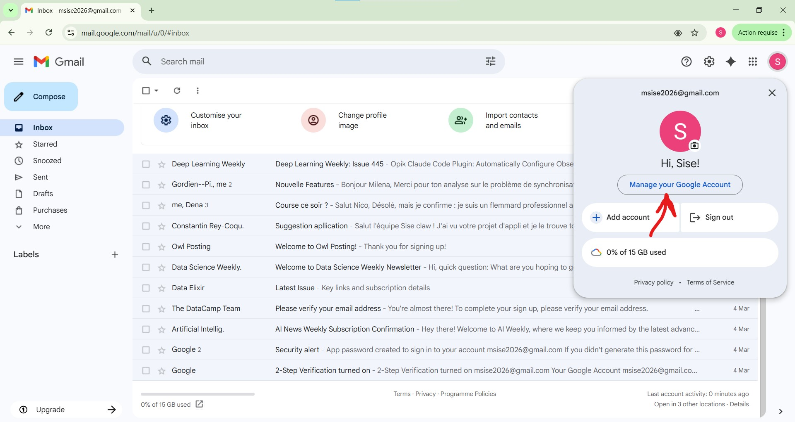
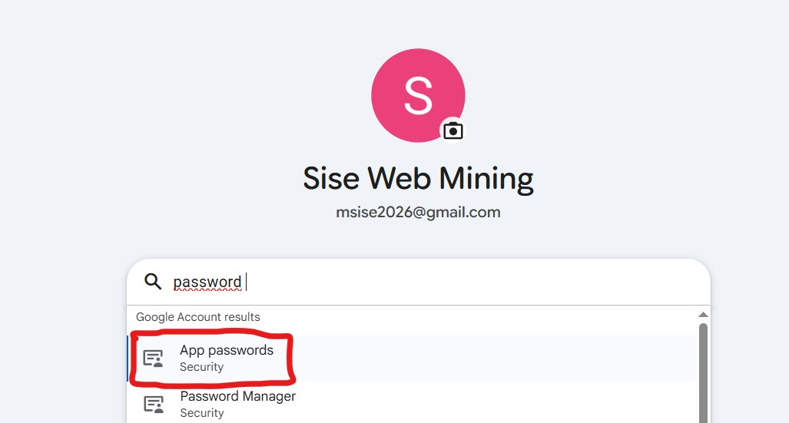
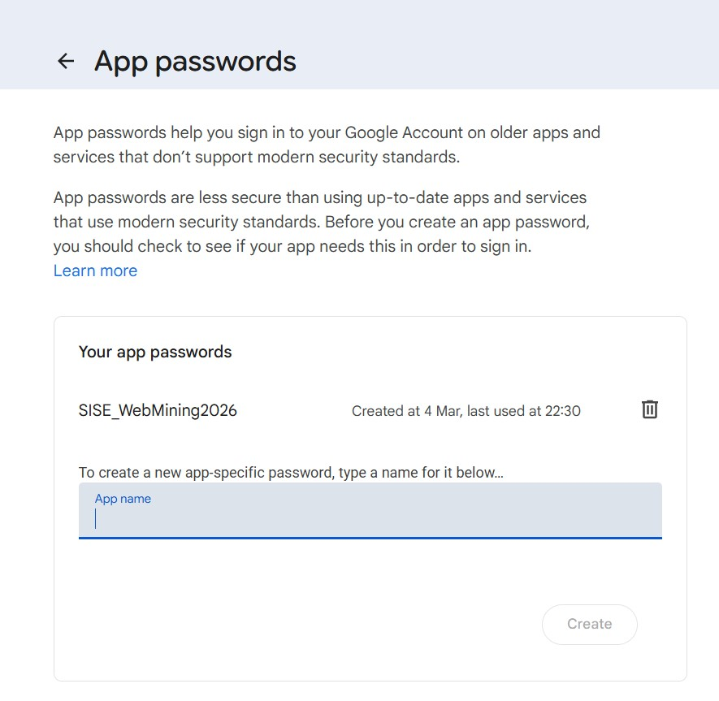

# Configuration Gmail pour SISE-CLAW

SISE-CLAW se connecte à Gmail via le protocole **IMAP** (lecture) et **SMTP** (envoi).
Gmail bloque les connexions avec le mot de passe du compte classique — il faut créer un **mot de passe d'application** dédié.

---

## Prérequis

Votre compte Gmail doit avoir la **validation en deux étapes activée**.

---

## Étape 1 — Activer la validation en deux étapes

1. Aller sur [myaccount.google.com](https://myaccount.google.com)
2. Cliquer sur **Sécurité** (dans le menu de gauche)
3. Sous "Comment vous vous connectez à Google", cliquer sur **Validation en deux étapes**
4. Suivre les instructions pour l'activer (numéro de téléphone ou application Authenticator)

> Si la validation en deux étapes est déjà activée, passer directement à l'étape 2.

---

## Étape 2 — Créer un mot de passe d'application

1. Aller sur [myaccount.google.com/apppasswords](https://myaccount.google.com/apppasswords)
   *(ou : Compte Google → Sécurité → Mots de passe des applications)*



2. Dans le champ **"Nom de l'application"**, saisir : `SISE-CLAW`



3. Cliquer sur **Créer**

4. Google génère un mot de passe de **16 caractères** du type :
   ```
   xxxx xxxx xxxx xxxx
   ```



5. **Copier ce mot de passe immédiatement** — il ne sera affiché qu'une seule fois.

---

## Étape 3 — Activer l'accès IMAP dans Gmail

1. Aller dans [Gmail](https://mail.google.com)
2. Cliquer sur l'icône **Paramètres** (roue dentée) en haut à droite
3. Cliquer sur **Voir tous les paramètres**
4. Aller dans l'onglet **Transfert et POP/IMAP**
5. Dans la section "Accès IMAP", sélectionner **Activer IMAP**
6. Cliquer sur **Enregistrer les modifications**

---

## Étape 4 — Configurer le fichier `.env`

Ouvrir le fichier `.env` à la racine du projet et renseigner :

```env
EMAIL_USER=votre.adresse@gmail.com
EMAIL_PASSWORD=xxxx xxxx xxxx xxxx
EMAIL_IMAP_SERVER=imap.gmail.com
```

> Le mot de passe peut être saisi avec ou sans espaces — les deux fonctionnent.

---

## Vérification

Pour tester que la connexion fonctionne :

```bash
uv run python -m src.app_gui.py
```

Puis parler ou saisir : `"Quels sont mes 2 derniers emails ?"`

Si la connexion échoue, vérifier :
- Que l'IMAP est bien activé dans les paramètres Gmail (étape 3)
- Que le mot de passe dans `.env` est bien celui de l'application (16 caractères), pas le mot de passe du compte
- Que `EMAIL_USER` correspond exactement à l'adresse Gmail utilisée

---

## Comptes compatibles

| Type de compte | Compatible |
|----------------|-----------|
| Gmail personnel (@gmail.com) | Oui |
| Google Workspace (pro/école) | Oui, si l'admin autorise l'IMAP |
| Outlook / Yahoo / autre | Non (non configuré) |

---

## Securite

- Le mot de passe d'application est different du mot de passe du compte Gmail
- Il peut etre revoque a tout moment depuis [myaccount.google.com/apppasswords](https://myaccount.google.com/apppasswords)
- Le fichier `.env` ne doit **jamais** etre commit sur GitHub — verifier que `.gitignore` contient bien `.env`
